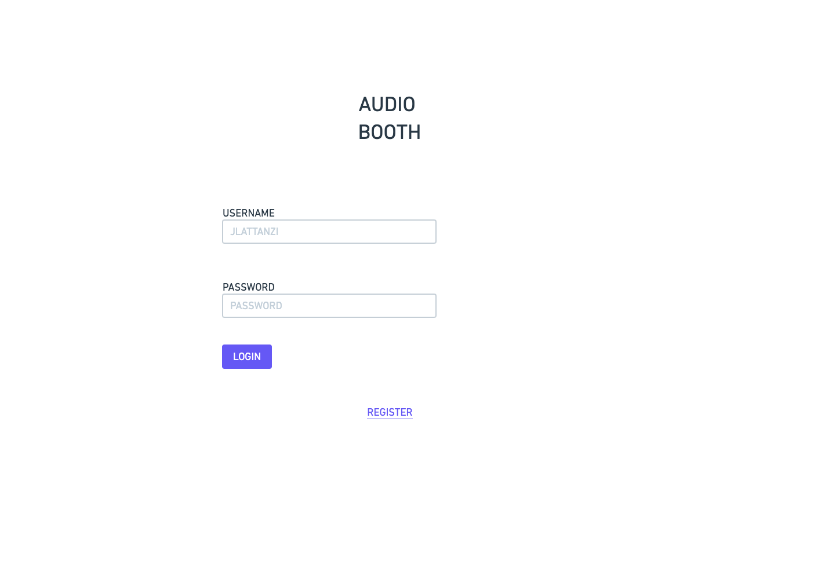
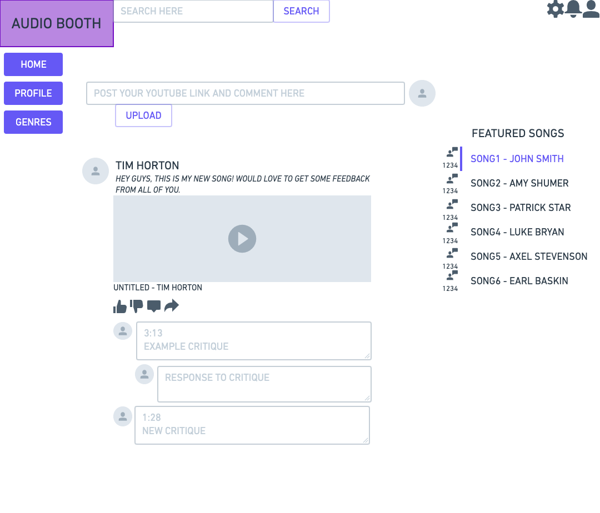

# Milestone 1
* Joseph Lattanzi
* Patrick Goss
* Jack Eberhardt

# Data Interactions

Our main data objects will be:
* Users
* Posts
* Comments
* Likes
* Followers/Following
* Featured Song/Artist

## Users
Users represent users of Audio Booth. They will have permissions to permit them to do certain things, as well as having a type (Artist or Consumer). Users will be able to edit their own information such as email, name, and avitar, and view other users page.

## Posts
Posts will be what artists are allowed to do on the home screen. They will be able to give a small description, as well as post a link to youtube, which will be embedded into the HTML so the youtube thumbnail will pop up and the video can be played on the local page. 

## Comments
Comments will be a section below the posts where consumers and artists alike will be able to critique the artist's post. This is going to be a very active section, where users can post comments, and other users can reply in a small thread, or post a new comment. Most of the action on the site will happen in the comments section.

## Likes
Each post will have a like button, where artists and consumers can show their liking for an artists song by liking their post, giving the artist a quick gauge of how well they did.

## Followers/Following
Consumers and Artists will be able to "Follow" each other, and these connections will be able to be seen by the users. These can be seen on both the profile page as well as the home page, seen as counts.

## Featured Song/Artist
The home page hosts a "Featured" section, where there will be a featured song and a featured artists for consumers and other artists to check out if they feel like it. We are aiming to have these be popular songs and popular artists so that users will be inclined to listen, critique, and follow.

# Login

## Wireframe

For our login page, kept it simple, but upgraded it a bit from our original wireframe. We added a background, as well as a seperate form tab in the middle of the page. This allows users to login if they have an existing account, as well as a "Register" link that will bring them to a page where they can create an account.

# Register

If a user doesn't have an account, they can click the register link on the login page and it will bring them to this page where they enter some simple information to make an account. We ask for first and last name, email, username, and a password.

# Profile

This was our first idea for a profile page. It included a header photo of the users choosing, their profile picture, and some information about themselves. On this page will also be their own posts, so when users come to their page they can see what the artist has posted and see the feedback they've received as well. We also anticipated having a statistics section with some of their user metrics.

Again, our anticipated profile page changed from when we made the wireframe to when we created the html. We went with a more aesthetically pleasing page, with a navbar where they can navigate to their page, the home activity page, as well as the genres page. On top of this, the profile page contains their name, their photo, numbers of their followers and posts, as well as a recent posts section which holds songs they've recently posted. These posts include comments of feedback from other users as well.

# Home Page

When we created the wireframe for our homepage, we anticipated having a navbar to navigate between different pages, which we did include in the html. We also anticipated the home page hosting a place for artists to post their music and a note. These posts would have a comments section below them to receive critique. Also, we anticipated having a featured songs section on the right side of the page which would hold a few songs that were popular that week.

For our final homepage, we did include a lot of the aspects that we anticipated including in the wireframe. We have a navbar up top to navigate between pages, we have a small portion on the side with the user's username, name, as well as their photo, and how many people they are following and how many follow them. The bulk of the page is populated by posts, which all host embeded youtube links which the artist will post along with a comment above. Each post has a section for likes and comments where users can critique the posted song. On top of this, the right side of the page is populated by a small Featured Song and Featured Artist section for users to check out of they feel inclined to.

# Division of Labor

Our group divided the labor completely equally. We didn't divvy up any sections of Milestone 1, we had multiple Zoom meetings where we would share the screen and let people control it so we could all work together on one thing at the same time. There was only one user that actually committed things to Github, but this was simply because we all worked together and it was easier to host the repo on one computer and push from there, the Github committs are not representative of the division of labor. 
