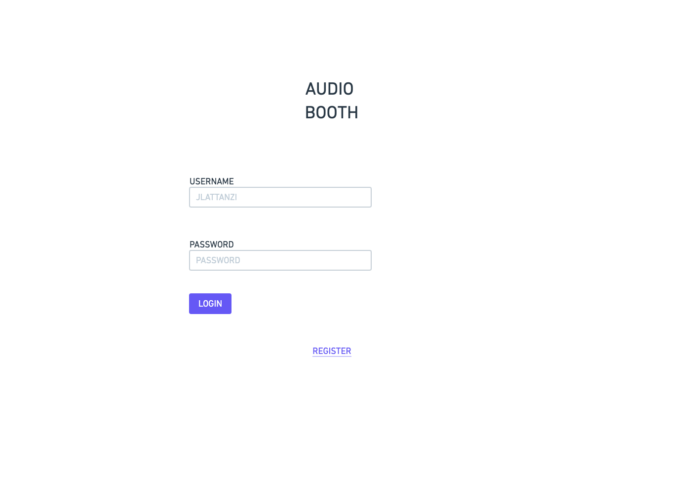
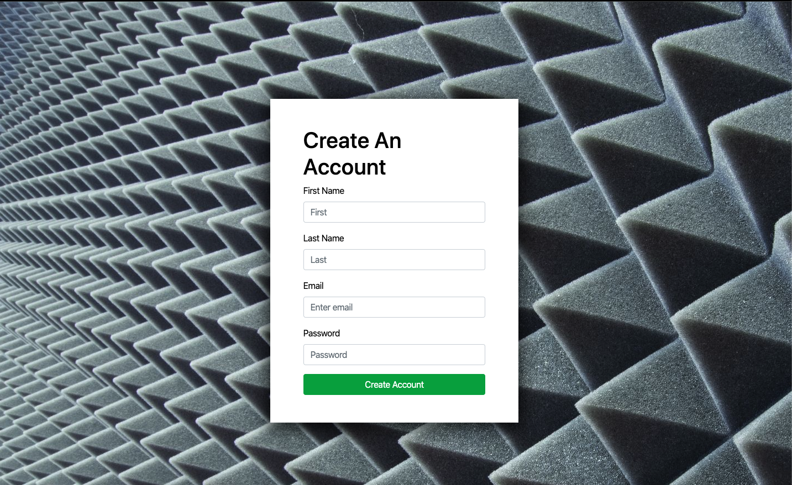
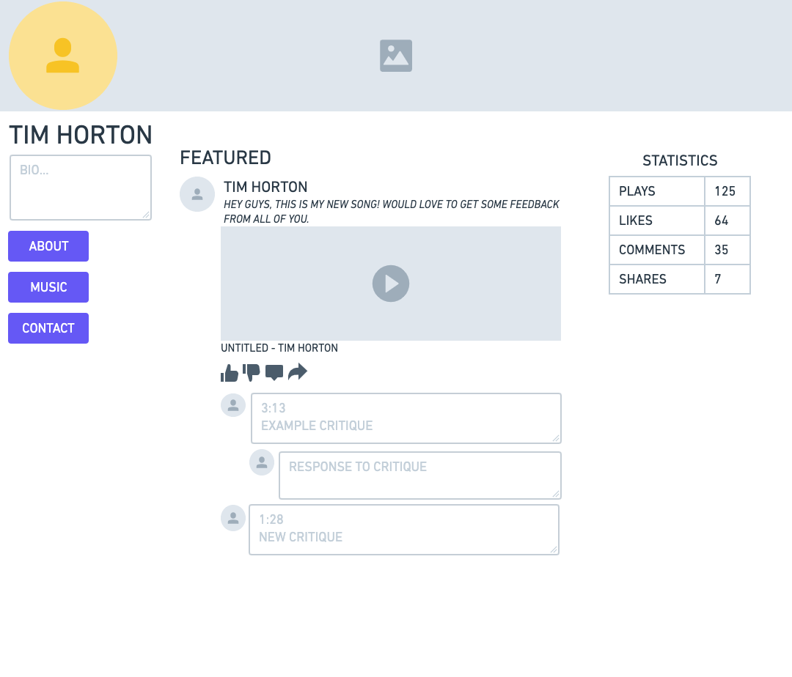
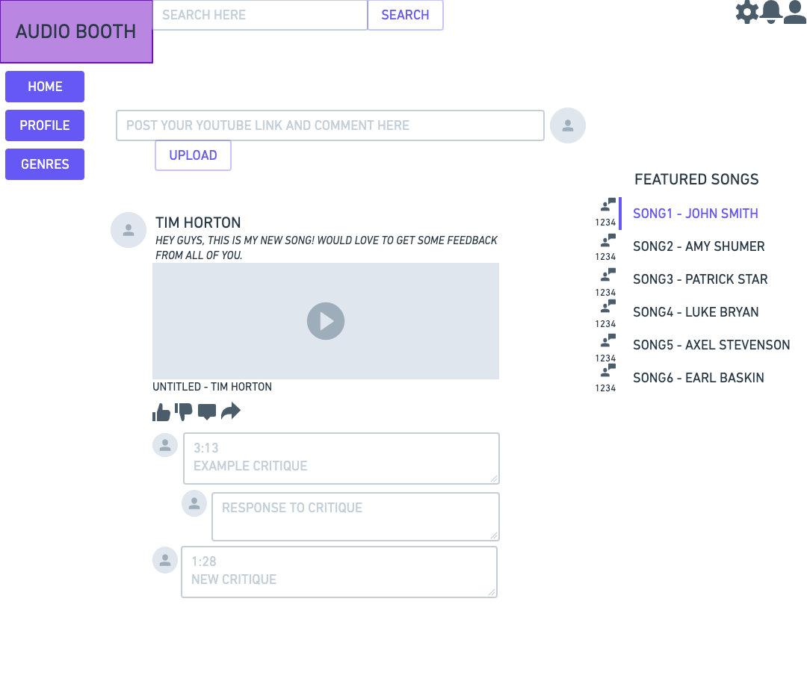

1. 

# API Representation

* See apiDocumentation.pdf *

2. 

# Login

    The login page is where a user's username and password will be read and authenticated for the user to log in.

# Resgister

    The register page is where the user create API will be implemented. They will be required to enter things such as a first name, last name, username, email, and password. They will also be assigned a userId in this create step. 

# Profile

    The profile page is where a lot of the read API will occur. Things such as followers, following, a user's posts, and comments on that post will be read on this page. From here, users will be able to delete their profile, posts and comments as well.

# Home

    The home page will host all user posts and comments which must be read. From here, users can also create new posts and posts. On top of this, users can 'update' posts by liking other's posts and following the user who posted.

3. Heroku URL: https://git.heroku.com/pure-thicket-80651.git

Contributions:
